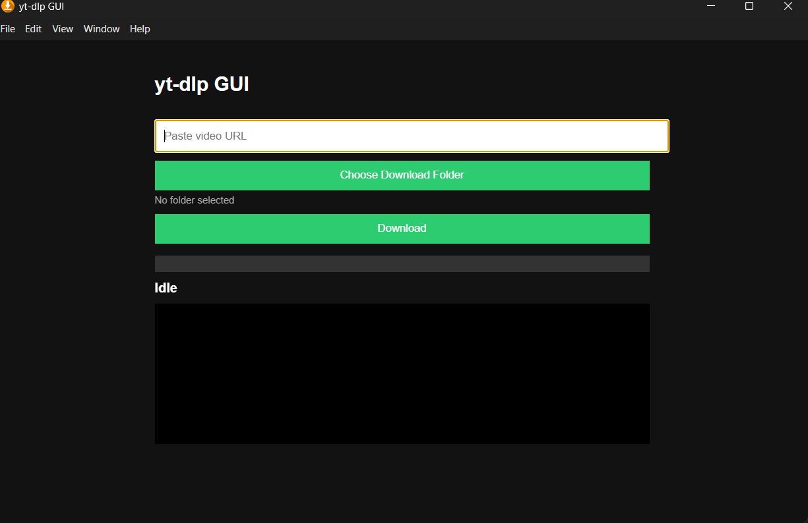

# 🎬 YT-DLP GUI

A simple desktop application built with Electron for downloading videos and audio using yt-dlp.

No terminal required — just paste a URL, choose a folder, and download.

---

# 📥 DOWNLOAD

👉 Latest Release:
https://github.com/tropical-express/yt-dlp-gui/releases/latest

### Available Downloads:
- 🖥️ Windows Installer (.exe) — Recommended
- 📁 Portable Version (.zip)
- 📄 Source Code (.zip)

---

# ✨ FEATURES

- 🎥 Download videos from URLs
- 🎵 Extract audio (MP3 support via yt-dlp)
- 📁 Choose download folder
- 📊 Real-time progress bar
- 🧾 Live logs and status updates
- 🖥️ Windows installer support

---

# 🖼️ PREVIEW

⚙️ HOW IT WORKS
1. Paste a video URL into the app
2. The Electron frontend sends the request to the backend process
3. yt-dlp fetches available formats
4. ffmpeg merges video/audio if needed
5. File is saved to your selected folder
6. Progress updates are shown in real time

📦 BUILD / DEVELOPMENT
## Install dependencies
``pnpm install``

## Run in development mode
``pnpm dev``

## Build application
``pnpm build``

🧱 REQUIREMENTS

Windows 10/11 (primary support)

Node.js 18+

pnpm

yt-dlp installed or bundled

ffmpeg installed or bundled

⚠️ DISCLAIMER
This tool is intended for educational and personal use only.
Users are responsible for complying with the terms of service of any websites they download from.

👤 AUTHOR
Created by tropical-express

